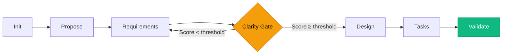
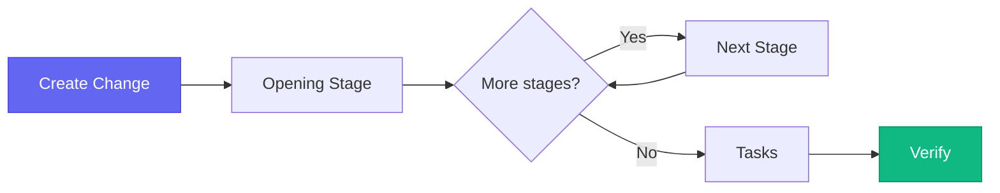
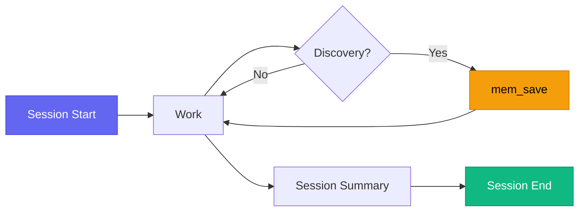

# Workflow Guide

This guide walks you through real workflows using Hoofy's three systems: **Memory**, **Change Pipeline**, and **Project Pipeline**. Each section shows what happens step by step, so you know what to expect.

---

## Table of Contents

- [Which System Do I Use?](#which-system-do-i-use)
- [Workflow 0: Explore Before You Plan](#workflow-0-explore-before-you-plan)
- [Workflow 1: New Project (Greenfield)](#workflow-1-new-project-greenfield)
- [Workflow 2: Changes in an Existing Project](#workflow-2-changes-in-an-existing-project)
- [Workflow 3: Memory Best Practices](#workflow-3-memory-best-practices)
- [The Adaptive Flow Matrix](#the-adaptive-flow-matrix)

---

## Which System Do I Use?

| I want to... | Use this | First command |
|---|---|---|
| Think through an idea before committing | **Explore** | `sdd_explore` |
| Build something from scratch | **Project Pipeline** | `sdd_init_project` |
| Add a feature to existing code | **Change Pipeline** | `sdd_change(type: "feature", size: "medium")` |
| Fix a bug | **Change Pipeline** | `sdd_change(type: "fix", size: "small")` |
| Refactor code | **Change Pipeline** | `sdd_change(type: "refactor", size: "medium")` |
| Remember a decision or discovery | **Memory** | `mem_save` |
| Pick up where I left off | **Memory** | `mem_context` |

---

## Workflow 0: Explore Before You Plan

Before jumping into a pipeline, use `sdd_explore` to capture unstructured thinking. This is especially useful when you're discussing an idea with the AI and haven't decided on scope or approach yet.

### When to use it

- You're brainstorming with the AI and want to capture the discussion
- You know the problem but aren't sure about the solution
- You have constraints or preferences the AI should know before planning
- You want the AI to suggest whether this is a small fix or a large feature

### How it works

> **You**: "I want to add search to the app. Maybe full-text? Not sure if I need fuzzy matching. It has to be fast — under 100ms."

> **AI**: *Calls `sdd_explore` with:*
> - **Goals**: Add search functionality to the app
> - **Constraints**: Response time under 100ms
> - **Unknowns**: Full-text vs. fuzzy matching, search scope (all fields or specific ones?)
> - **Preferences**: Performance is a priority

The context is saved to memory with a topic key. If the discussion evolves:

> **You**: "Actually, let's do full-text with SQLite FTS5 — no external dependencies."

> **AI**: *Calls `sdd_explore` again — upserts the same observation with updated decisions*

### What you get

- Structured context in memory that the AI references when you start a pipeline
- A suggested change type and size based on keywords (e.g., "new feature, medium complexity")
- No duplicates — repeated calls update the same observation via topic key

### Then what?

After exploring, start the right pipeline:

```
sdd_explore → sdd_change(type: "feature", size: "medium")
sdd_explore → sdd_init_project  (if it's greenfield)
```

The AI already has your goals, constraints, and decisions in memory — the pipeline starts with clarity.

---

## Workflow 1: New Project (Greenfield)

For building something from scratch. The pipeline forces you to think through requirements before writing a single line of code.

### The Pipeline



### Step by Step

**Stage 1 — Init** (`sdd_init_project`)

You tell the AI what you want to build. It creates the `sdd/` directory and project config.

> **You**: "I want to build a CLI tool that tracks daily habits"
>
> **AI**: *Creates `sdd/sdd.json` with project name and mode (guided/expert)*

**Stage 2 — Propose** (`sdd_create_proposal`)

The AI asks you questions to understand the problem, users, and scope. Then it writes a structured proposal with:
- Problem statement — what pain are you solving?
- Target users — who is this for?
- Proposed solution — what does it do (no tech details yet)?
- Out of scope — what it does NOT do (prevents scope creep)
- Success criteria — how do we know it works?

> **You**: "It's for developers who forget to exercise, drink water, etc."
>
> **AI**: *Writes proposal to `sdd/proposal.md`*

**Stage 3 — Requirements** (`sdd_generate_requirements`)

The AI reads the proposal and extracts formal requirements with MoSCoW prioritization:
- **Must Have** (FR-001, FR-002...) — launch blockers
- **Should Have** — important but not blocking
- **Could Have** — nice-to-have for the future
- **Won't Have** — explicitly excluded
- **Non-Functional** (NFR-001...) — performance, security, usability

> **AI**: *"FR-001: Users can add a new habit with name and daily goal"*
> **AI**: *"NFR-001: CLI response time must be under 200ms"*
> **AI**: *Writes requirements to `sdd/requirements.md`*

**Stage 4 — Clarity Gate** (`sdd_clarify`) ⚡

This is the core innovation. The AI analyzes your requirements across **8 dimensions**:

| Dimension | What it checks |
|---|---|
| Target users | Are personas specific enough? |
| Core functionality | Is each feature clearly defined? |
| Data model | Are entities and relationships clear? |
| Integrations | Are external dependencies identified? |
| Edge cases | Are error scenarios handled? |
| Security | Are auth/data-protection needs clear? |
| Scale & performance | Are load expectations defined? |
| Scope boundaries | Is the line between in/out of scope sharp? |

Each dimension gets a score (0-100). The pipeline **blocks** until the overall score meets the threshold:
- **Guided mode**: 70/100
- **Expert mode**: 50/100

If ambiguities are found, the AI asks you specific questions. You answer, it rescores. This loop continues until the gate passes.

> **AI**: *"Your data model is unclear — does a habit have categories? Can habits repeat on specific days or is it daily only?"*
>
> **You**: *"Daily only, no categories in v1"*
>
> **AI**: *Score jumps from 55 to 78 — gate passes*

**Stage 5 — Design** (`sdd_create_design`)

Now the AI writes the technical architecture:
- Architecture overview and patterns
- Tech stack with rationale
- Component breakdown (mapped to requirements)
- Data model with schema
- API contracts (if applicable)
- Security measures
- Infrastructure and deployment

> **AI**: *Writes design to `sdd/design.md`*

**Stage 6 — Tasks** (`sdd_create_tasks`)

The AI breaks the design into atomic, implementable tasks. Each task has:
- Unique ID (TASK-001)
- Requirements it covers (FR-001, NFR-002)
- Components affected
- Dependencies on other tasks
- Acceptance criteria (checkboxes)
- A dependency graph showing parallelization opportunities
- Optional **wave assignments** — tasks grouped into parallel execution waves (see [Wave Assignments](#wave-assignments) below)

> **AI**: *"TASK-001: Set up project scaffolding → TASK-002: Implement habit storage → TASK-003: Add CLI commands..."*
> **AI**: *Writes tasks to `sdd/tasks.md`*

**Stage 7 — Validate** (`sdd_validate`)

Cross-artifact consistency check. The AI verifies:
- Every requirement has at least one task covering it
- Every component in the design has tasks assigned
- No tasks reference non-existent requirements
- No scope creep (tasks stay within proposal boundaries)

Verdict: **PASS**, **PASS_WITH_WARNINGS**, or **FAIL** (sends you back to fix gaps).

### What you get

```
sdd/
├── sdd.json           # Pipeline state and config
├── proposal.md        # Problem, users, solution, scope
├── requirements.md    # Formal requirements (MoSCoW)
├── clarifications.md  # Clarity Gate Q&A
├── design.md          # Technical architecture
├── tasks.md           # Implementation breakdown
└── validation.md      # Cross-check results
```

Every artifact is a markdown file you can read, edit, and version control. The AI references these specs while coding — no more hallucinated features.

---

## Workflow 2: Changes in an Existing Project

For ongoing development. The pipeline **adapts** — a small bug fix gets 3 stages, a large feature gets 6.

### The Pipeline



The opening stage and intermediate stages change based on **type × size**:

### Example: Small Fix (3 stages)

> **You**: "The search crashes when the query is empty"

```
describe → tasks → verify
```

The AI describes the bug, breaks the fix into tasks, and verifies. Quick, minimal ceremony.

### Example: Medium Feature (4 stages)

> **You**: "I want to add CSV export to the reports"

```
propose → spec → tasks → verify
```

The AI writes a brief proposal, extracts requirements, creates tasks, and verifies coverage.

### Example: Large Feature (6 stages)

> **You**: "I want to add a plugin system with hooks and lifecycle management"

```
propose → spec → clarify → design → tasks → verify
```

Full ceremony — proposal, requirements, Clarity Gate, architecture, tasks, validation. The same rigor as a greenfield project, scoped to the change.

### Change Artifacts

Each change lives in its own directory:

```
sdd/changes/
└── fix-empty-query-crash/
    ├── change.json     # Metadata (type, size, stages, status)
    ├── describe.md     # What's the problem?
    ├── tasks.md        # Implementation breakdown
    └── verify.md       # Verification results
```

### ADRs (Architecture Decision Records)

At any point during a change, you can capture a decision:

> **You**: "We decided to use SQLite instead of PostgreSQL for the local store"
>
> **AI**: *Records ADR with context, decision, rationale, and rejected alternatives*

ADRs are saved both in the change directory and in persistent memory — they survive archival.

### Wave Assignments

When the AI creates the task breakdown (in either pipeline), it can optionally group tasks into parallel execution waves:

```markdown
**Wave 1** (parallel — no dependencies):
- TASK-001: Project scaffolding
- TASK-002: Database schema

**Wave 2** (parallel — depends on Wave 1):
- TASK-003: API endpoints
- TASK-004: Auth module

**Wave 3** (sequential — depends on Wave 2):
- TASK-005: Integration tests
```

The algorithm is simple: tasks with no dependencies go in Wave 1, tasks depending only on Wave 1 go in Wave 2, and so on. This tells you:
- Which tasks can run in parallel (same wave)
- Which must wait (later wave)
- The critical path through the implementation

The AI generates wave assignments automatically when the dependency graph has parallelization opportunities. They appear in the `tasks.md` artifact alongside the dependency graph.

---

## Workflow 3: Memory Best Practices

Memory is always running in the background. Here's how to get the most out of it.

### Session Lifecycle



1. **Start** — AI calls `mem_session_start` and `mem_context` to load recent history
2. **Work** — As you work, the AI saves observations when something important happens
3. **End** — AI writes a session summary capturing what was done, discovered, and what's next

### What to Save

| Type | Save when... | Example |
|---|---|---|
| `decision` | You chose approach A over B | "Chose PostgreSQL over MongoDB for ACID compliance" |
| `architecture` | You defined a structural pattern | "Event-driven communication between services" |
| `bugfix` | You found and fixed a bug | "FTS5 crash on special characters — wrapped in quotes" |
| `pattern` | You established a convention | "All API errors return `{error, code, details}` shape" |
| `discovery` | You learned something non-obvious | "modernc.org/sqlite doesn't support extensions" |
| `config` | You changed environment or tooling | "Switched from npm to pnpm for workspace support" |

### Search Patterns

- `mem_search("authentication")` — find past decisions about auth
- `mem_context` — what happened in the last few sessions?
- `mem_timeline(observation_id)` — what happened before and after a specific event?
- `mem_search` + `mem_get_observation` — search finds it, get retrieves full content

### Topic Keys (Evolving Knowledge)

For knowledge that changes over time, use topic keys. Instead of creating 10 observations about the "database schema", the AI uses `topic_key: "architecture/database-schema"` — each new save **updates** the existing observation instead of creating a duplicate.

### Knowledge Graph

Observations can be connected with typed, directional relations to form a knowledge graph:

| Relation | Meaning | Example |
|---|---|---|
| `relates_to` | General association | A pattern relates to a convention |
| `depends_on` | A requires B | A task depends on a design decision |
| `caused_by` | A was triggered by B | A bugfix was caused by a discovery |
| `implements` | A realizes B | Code implements a design decision |
| `supersedes` | A replaces B | A new decision supersedes an old one |
| `part_of` | A belongs to B | A component is part of an architecture |

The AI creates relations automatically when it recognizes connections between observations. You can also ask it explicitly: *"relate the JWT decision to the auth bugfix"*.

**Traversing the graph**: Use `mem_build_context` with a starting observation and depth to pull in everything connected. This is powerful for understanding the full context around a decision — what caused it, what implements it, what it relates to.

```
mem_build_context(observation_id: 42, max_depth: 2)
→ Returns the observation, its direct relations, and their relations
```

---

## The Adaptive Flow Matrix

The change pipeline selects stages automatically. Here's every combination:

| Type | Small | Medium | Large |
|---|---|---|---|
| **Fix** | describe → tasks → verify | describe → spec → tasks → verify | describe → spec → design → tasks → verify |
| **Feature** | describe → tasks → verify | propose → spec → tasks → verify | propose → spec → clarify → design → tasks → verify |
| **Refactor** | scope → tasks → verify | scope → design → tasks → verify | scope → spec → design → tasks → verify |
| **Enhancement** | describe → tasks → verify | propose → spec → tasks → verify | propose → spec → clarify → design → tasks → verify |

**12 flows, all deterministic.** The AI picks the right one — you just say what you want to do and how big it is.

### Stage Descriptions

| Stage | Purpose | Used by |
|---|---|---|
| `describe` | Quick description of the change | Fix, Feature (S), Enhancement (S) |
| `scope` | What changes and what stays the same | Refactor only |
| `propose` | Full proposal with problem/solution/scope | Feature (M/L), Enhancement (M/L) |
| `spec` | Formal requirements (MoSCoW) | Medium and Large changes |
| `clarify` | Clarity Gate — resolve ambiguities | Large Feature and Enhancement only |
| `design` | Technical architecture | Large changes + Medium Refactor |
| `tasks` | Implementation breakdown | Every change |
| `verify` | Verification checklist | Every change |
